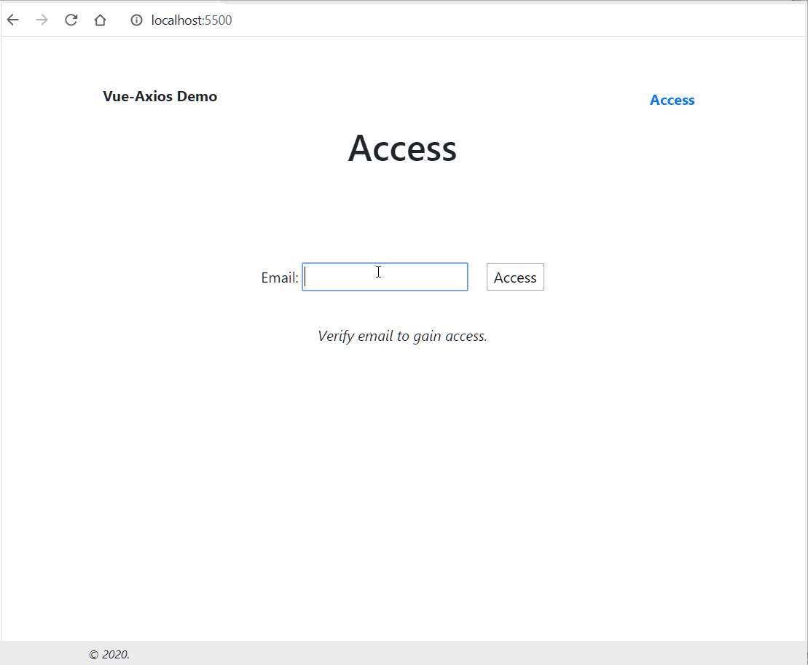

# Simple Demo App

Demos how Vue + Axios from a CDN can be used directly in a HTML to create beautiful apps :)

## What we do here?

1. Create a simple HTML
1. Include Vue + Vue Router + Axios from CDN
1. Authenticate user email (no server - only mocks!)
1. Fetch posts for user

**What needs to be done?**

1. Pagination buttons!

## Components of this App

**index.html**

- Includes all the javascript files
- Registers components and router
- Loads Vue

**\*.vue.js files**

- We do not use `vue-loader`, but go bare-bones.
- All "vue components" are plain javascript objects to begin with. And, these come from `*.vue.js` files

## Anything Else?

That's all there is to this world.
